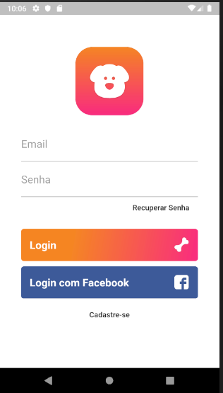
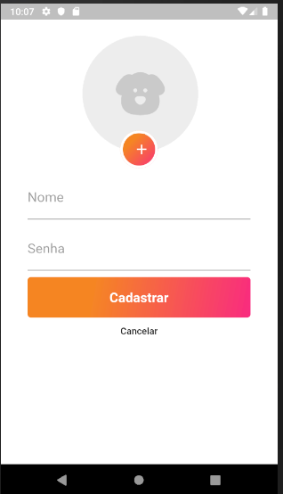

# dog_life

A Flutter application interface dog.

design credits: https://www.behance.net/gallery/73935801/Doglife-Ui-Kit-Free-for-Adobe-XD

## Screenshots

  

  

  

## Getting Started

This project is a starting point for a Flutter application.

A few resources to get you started if this is your first Flutter project:

- [Lab: Write your first Flutter app](https://flutter.io/docs/get-started/codelab)
- [Cookbook: Useful Flutter samples](https://flutter.io/docs/cookbook)

For help getting started with Flutter, view our 
[online documentation](https://flutter.io/docs), which offers tutorials, 
samples, guidance on mobile development, and a full API reference.
